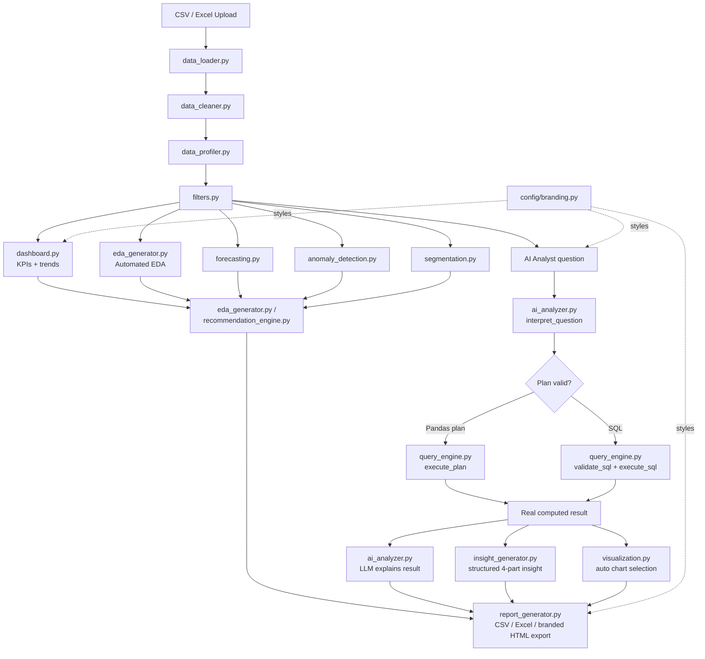

# 📊 Clariana Analytics

*A white-label AI data analytics platform — deployable under any client's brand in minutes.*

Upload a CSV or Excel file and get automatic data profiling, natural-language querying, AI-generated insights, forecasting, anomaly detection, customer segmentation, and one-click exportable reports — all backed by real Pandas/SQL computation, never LLM-hallucinated numbers.

## Overview

Most "chat with your data" tools let an LLM guess at numbers, which makes them unreliable for anything beyond a demo. This platform takes a different approach: the LLM is only ever responsible for *interpreting* a question and *explaining* an already-computed result — every actual number comes from validated Pandas or SQL execution against the real dataset. That separation is the architectural backbone of the whole app, enforced in code rather than by prompting alone.

This build is designed to be **re-branded per client**: every colour, name, logo, and tagline lives in one config file and can be overridden with environment variables, so the same codebase can ship as a bespoke-looking analytics tool for each engagement without touching a single line of application code.

## Features

- 📂 **Upload & Clean** — CSV/Excel upload with validation, missing-value/duplicate/outlier detection, and user-approved cleaning actions
- 🔍 **Data Explorer** — full profiling dashboard (overview, data quality, numeric stats, categorical breakdowns) plus interactive filters (date range, region, category, product, segment, payment method)
- 📊 **Analytics Dashboard** — auto-adapting KPIs and trend/breakdown charts that gracefully skip whatever columns a given dataset doesn't have
- 🤖 **AI Analyst** — ask questions in plain English; answered via a validated Pandas plan *or* generated SQL (your choice), with automatic chart selection and a four-part AI insight (Finding / Explanation / Business Impact / Recommendation) for every answer
- 💬 **Conversational memory** — follow-up questions ("what about its monthly trend?") resolve pronouns using recent conversation context
- 📈 **Automated EDA** — one-click exploratory report: correlations, outliers, key findings, and recommendations, generated from real computed facts
- 🔮 **Forecasting** — explainable linear-trend projection with a widening confidence band and a clear "not a guarantee" disclaimer
- ⚠️ **Anomaly Detection** — IQR-based outlier flagging with per-record risk level and plain-language reason
- 👥 **Customer Segmentation** — RFM (Recency/Frequency/Monetary) rule-based segments, or optional K-Means clustering, with AI-written segment explanations
- 💡 **AI Recommendations** — a prioritized action list synthesized from whatever analysis has already been run
- 📄 **Reports** — export any result, forecast, or anomaly table as CSV/Excel, plus a combined, brand-styled full-session HTML report
- 🎨 **White-label theming** — one config file controls brand name, logo, colours, and consultancy attribution across every page, chart, and exported report
- 🔒 **Security & reliability** — SQL injection/comment-obfuscation guards, read-only SQL enforcement, no blind execution of AI-generated Python, file-size limits, input sanitization, and friendly error messages backed by a real logging layer
- ⚡ **Performance** — Streamlit caching throughout so repeated reruns and repeated LLM calls don't redo work
- ✅ **Tested** — pytest suite covering the data loader, profiler, query engine, visualization, and forecasting modules

## Architecture



**Core principle:** the LLM never calculates a number. It only (1) turns a question into a structured, validated plan or SQL query, or (2) explains a result that Pandas/SQL already computed. This is enforced at the code level, not just by prompting — `query_engine.py` rejects any operation, column, or aggregation it doesn't recognize before anything runs.

**Every LLM call goes through one function** — `chat_completion()` in `utils/llm_client.py` — so switching providers, or adding a new one later, never touches `ai_analyzer.py` or any of the modules that use it.

## Tech Stack

| Layer | Technology |
|---|---|
| Language | Python 3.12 |
| Frontend | Streamlit + streamlit-option-menu |
| Data | Pandas, NumPy |
| Database | SQLite (in-memory, per-session) |
| Visualization | Plotly, themed via a shared brand template |
| Machine Learning | scikit-learn (K-Means, IQR/statistical methods) |
| Generative AI | OpenAI (`gpt-4o-mini` default) or Google Gemini, selected by one config value — see `utils/llm_client.py` |
| Testing | pytest (37 tests) |
| Environment | VS Code, `venv` |

## White-Label Setup

Every brand-facing detail — name, tagline, logo, colours, and consultancy attribution — lives in `config/branding.py` and can be overridden per deployment with environment variables. Spinning up a new client instance:

1. Copy `.env.example` to `.env`
2. Set `BRAND_CLIENT_NAME`, `BRAND_TAGLINE`, and (optionally) `BRAND_LOGO_URL`
3. Set `BRAND_PRIMARY_COLOR` / `BRAND_DARK_COLOR` to the client's brand palette — leave unset to keep the Clariana teal/cyan default
4. Set `LLM_PROVIDER` + `LLM_API_KEY`
5. Run the app — the header, sidebar, KPI cards, every chart, and the exported HTML report all re-theme automatically. No application code changes needed.

`BRAND_SHOW_POWERED_BY` controls the small "Powered by Clariana" attribution shown in the sidebar and exported reports — set it to `false` for engagements where the client wants a fully unbranded hand-off.

See `.env.example` for the full list of variables.

## Installation

```bash
# Clone the repository
git clone https://github.com/<your-org>/clariana-analytics.git
cd clariana-analytics

# Create and activate a virtual environment
python -m venv venv
venv\Scripts\activate        # Windows
source venv/bin/activate     # macOS/Linux

# Install dependencies
pip install -r requirements.txt
```

Copy `.env.example` to `.env` and fill in at least the LLM section:

```
LLM_PROVIDER=openai
LLM_API_KEY=your_api_key_here
```

Get an OpenAI key at [platform.openai.com/api-keys](https://platform.openai.com/api-keys), or a Gemini key at [aistudio.google.com/apikey](https://aistudio.google.com/apikey) if you set `LLM_PROVIDER=gemini`.

## Usage

```bash
streamlit run app.py
```

1. **📂 Data Upload** — upload a CSV/Excel file and apply cleaning actions
2. **🔍 Data Explorer** — filter the data and review profiling stats
3. **📊 Analytics** — view auto-generated KPIs and charts
4. **🤖 AI Analyst** — ask questions about your data
5. Explore **📈 Visualization**, **🔮 Forecasting**, **⚠️ Anomaly Detection**, **👥 Customer Segmentation**, and **💡 AI Recommendations** as needed
6. **📄 Reports** — export everything as CSV, Excel, or one combined, brand-styled HTML report

## Example Questions

- What is the total revenue?
- Which product generated the highest revenue?
- What is the monthly revenue trend?
- Which region performs best?
- Is there a correlation between quantity and profit?
- Average profit for orders in the North region
- Show revenue and profit by category

## Screenshots

*(Add screenshots of the Dashboard, AI Analyst, and Forecasting pages here before sending to a client.)*

```
[ Dashboard screenshot ]
[ AI Analyst screenshot ]
[ Forecasting screenshot ]
```

## Project Structure

```
clariana-analytics/
├── app.py                     # Streamlit entry point, page routing
├── requirements.txt
├── .env.example                # Copy to .env — LLM key + brand overrides
├── .gitignore
├── pytest.ini
│
├── .streamlit/
│   └── config.toml            # Base Streamlit theme (brand colours)
│
├── config/
│   ├── settings.py            # Reads .env, exposes LLM provider/model config
│   └── branding.py            # White-label config — name, logo, colours, attribution
│
├── data/
│   ├── sample_sales.csv
│   └── generate_sample.py     # Synthetic dataset generator
│
├── modules/
│   ├── data_loader.py
│   ├── data_cleaner.py
│   ├── filters.py
│   ├── data_profiler.py
│   ├── dashboard.py
│   ├── query_engine.py        # Plan/SQL validation + execution
│   ├── ai_analyzer.py         # LLM call orchestration (provider-agnostic)
│   ├── visualization.py
│   ├── insight_generator.py
│   ├── eda_generator.py
│   ├── forecasting.py
│   ├── anomaly_detection.py
│   ├── segmentation.py
│   ├── recommendation_engine.py
│   └── report_generator.py    # CSV / Excel / branded HTML export
│
├── prompts/
│   ├── analyst_prompt.py
│   └── insight_prompt.py
│
├── utils/
│   ├── helpers.py
│   ├── validators.py
│   ├── logger.py
│   ├── llm_client.py          # OpenAI / Gemini provider abstraction
│   └── theme.py                # Brand CSS + Plotly template
│
├── tests/
│   ├── conftest.py
│   ├── test_data_loader.py
│   ├── test_profiler.py
│   ├── test_query_engine.py
│   ├── test_visualization.py
│   └── test_forecasting.py
│
└── logs/
    └── app.log                # Runtime error log (gitignored)
```

## Future Improvements

- True PDF export (currently HTML, printable to PDF via browser)
- Multi-file / multi-table joins and a persistent (non-in-memory) database option
- Additional forecasting methods (e.g. seasonal decomposition) for datasets with clear seasonality
- CI pipeline running the pytest suite on every push
- User authentication for multi-user / multi-client deployment
- Optional per-client config presets (a `clients/<name>.env` folder) instead of a single `.env`

## About this template

Maintained by [Clariana](https://clariana.co.uk) as a reusable analytics deliverable for client engagements. The architecture (LLM-never-computes, validated plans/SQL, code-enforced guardrails) and the white-label branding layer are both designed to survive being handed off, re-skinned, and redeployed without a rebuild.
